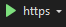

# vending-machine
C23310 - Daniel Gómez Solís

## Manual

### frontend

#### Dependencies

* NodeJS
https://nodejs.org/en/download/prebuilt-installer

* Vue Client
```
npm install @vue/cli
```

* Vue Router
```
npm install vue-router@4 -save
```

#### Execute Instructions

Inside `\vending-machine` travel to `\frontend` in terminal.

Run the following command:
```
npm run serve
```

On your web browser of preference, insert the following in the navagation bar:
```
http://localhost:8080/
```

### backend

Inside `\vending-machine` travel to `\backend` in your file explorer.

Double click `backend.sln`.

This should open Microsoft Visual Studio. In the navigation bar click the
following:



Backend host is located at:
```
https://localhost:7254/
```
